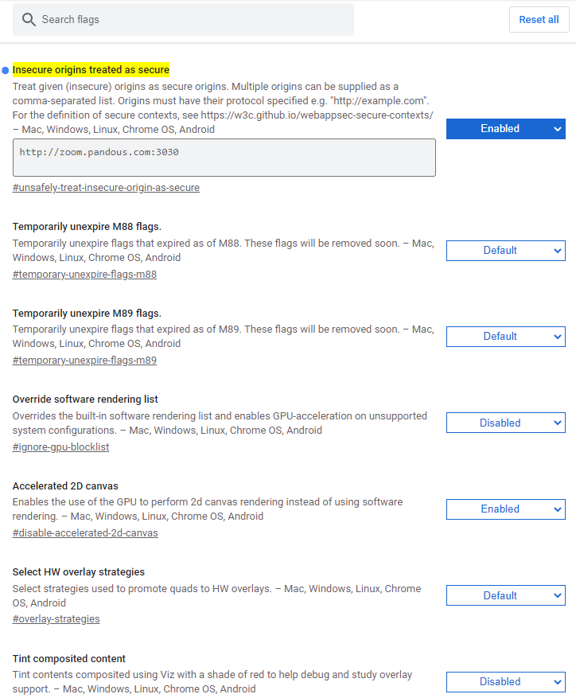

# How to access the service?
1. Go to `chrome://flags/#unsafely-treat-insecure-origin-as-secure` on Chrome browser.
2. Input the address `http://zoom.pandous.com:3030` in the input box of `Insecure origins treated as secure`.

3. Relaunch the Chrome browser.

